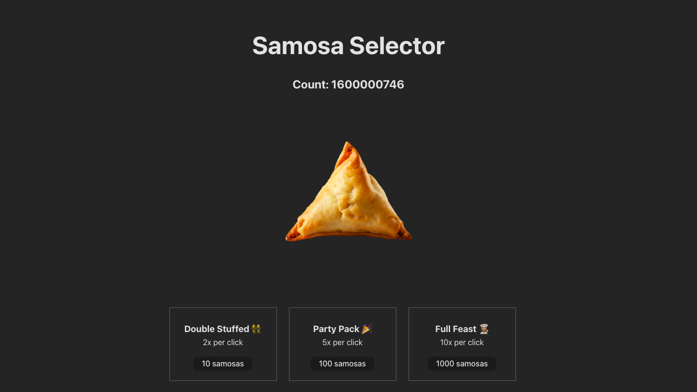

# Web Development Lab 2 - *Samosa Selector*

Submitted by: **Kelly Chan**

This web app: **Samosa Selector is a game that is based on an incremental game called Cookie Clicker. The goal of the game is to produce as many cookies by clicking on the Big Cookie as you can. However, in this version, instead of clicking a cookie, the user will be selecting a delicious samosa.**
The game starts out with the user having zero samosas. When the user clicks the Big Samosa, it initially produces one samosa per click. Then,
- When the user has 10 samosas, they can buy a Double Stuffed upgrade, which produces double the amount of samosas per click.
- When the user has 100 samosas, they can buy the Party Pack upgrade, which produces 5x the amount of samosas per click.
- When the user has 1000 samosas, they can buy the Full Feast upgrade, which produces 10x the amount of samosas per click.
The game continues on forever and the user can continue to gain gigantic amounts of samosas. Yum!

Time spent: **1** hour spent in total

## Required Features

The following **required** functionality is completed:

The user can click on the large samosa to increase their samosa count by 1. There are three available upgrades, Double Stuffed, Party Pack, and Full Feast, that the user can purchase to increase the number of samosas per click.
- [X] A large samosa that the user can click to harvest one samosa at a time
- [X] A counter displaying the number of samosas the user currently has
- [X] Three upgrades that increase the effectiveness of the user’s cursor at certain point thresholds

## Additional Features

The following **additional** functionality is completed:

When purchasing an upgrade, the user loses samosas from their total count. There is also an added "pulse" effect to the samosa that shrinks the large samosa when clicked and grows when hovered over.
- [X] When purchasing an upgrade, the user loses samosas from their total count
- [X] Decrease the scale of the large samosa when the user clicks the samosa to create a pulse effect

## Image

Here's an image of implemented required features:

## License

    Copyright 2025 Kelly Chan

    Licensed under the Apache License, Version 2.0 (the "License");
    you may not use this file except in compliance with the License.
    You may obtain a copy of the License at

        http://www.apache.org/licenses/LICENSE-2.0

    Unless required by applicable law or agreed to in writing, software
    distributed under the License is distributed on an "AS IS" BASIS,
    WITHOUT WARRANTIES OR CONDITIONS OF ANY KIND, either express or implied.
    See the License for the specific language governing permissions and
    limitations under the License.